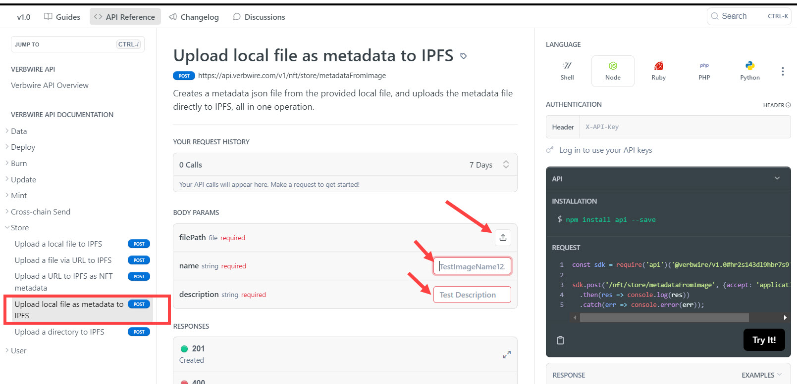
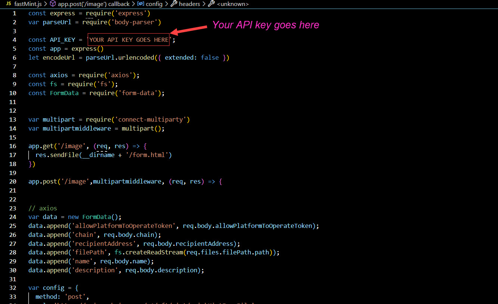
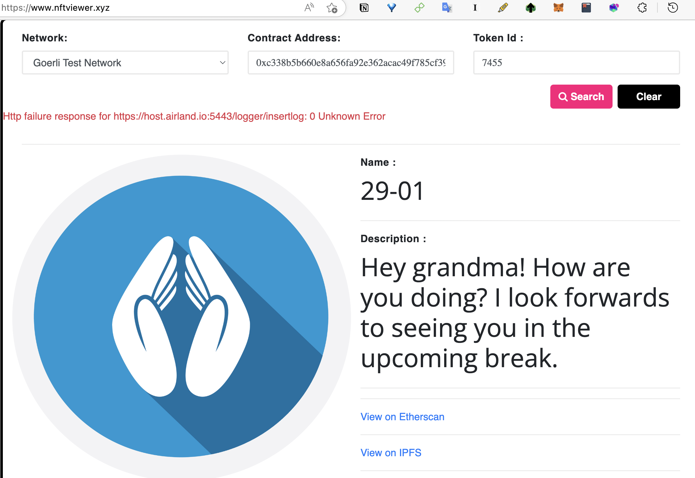

    

# fastMint with GrandConnect

https://user-images.githubusercontent.com/57610694/215318999-469106cb-0f01-4cc8-b18f-9f60895b8239.mp4

We don't realise how precious our conversations with others are until we are no longer able to have them. One way of preserving these conversations is by keeping them forever on the blockchain, so that that you can revisit them in the future, and know which conversations led to which. This simple minting app was built using the Verbwire API based on the Verbwire tutorial. The app lets you mint an NFT from metadata file based on conversations that you have had on GrandConnect. You can mint on any of the 14 supported blockchains (7 testnets and 7 mainnets). For more details on using the Verbwire API you can access the full API docs [here](https://docs.verbwire.com/docs)

## Requirements

1. You'll need a Verbwire API Key. You can get a free API key [HERE](https://www.verbwire.com/auth/register)

## Steps to run program locally

1. In the file, fastMint.js, replace the text "YOUR API KEY GOES HERE" with your actual API key. See image in the additional section below.
2. From you command prompt, type in *npm i* to install node modules
3. From you command prompt, type in *node fastMintGrandConnect.js* to start the program
4. Open your browser and goto localhost:8080/url to mint directly from a metadata file, or localhost:8080/image to mint directly from an image file. See Additional info section below for screenshots.

## Additional Info:

### Minting from a metadata file

1. To see the program working you can test with this sample metadatafile:

   https://ipfs.io/ipfs/bafyreictnz5wg4yb73gepfvmuheybhhojfakgceaovbcadbt3mpwrqxuzy/metadata.json
2. You can create your own metadatafile very easily by using the Verbwire endpoint, *Upload local file as metadata to IPFS*, [HERE](https://docs.verbwire.com/reference/post_nft-store-metadatafromimage). Simply upload your file and you'll get a metadata .json link returned.

    

### Showing where to input your API Key

    

### Screenshots of the GrandConnect conversations NFTs

Example mint from conversations

    

